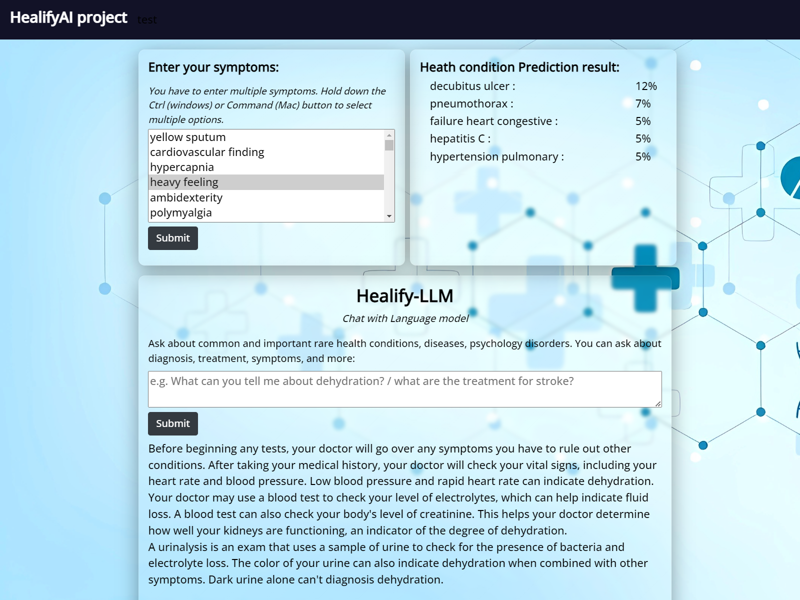

<h1 align="center">HealifyAI - LLM based Healthcare System</h1>

This project aims to develop a comprehensive healthcare system to aid healthcare professionals. While also providing knowledge to patients. It uses a LLM and traditional Machine Learning (ML) to provide in-depth answers to medical health condition queries and can predict diseases based on patient symptoms. 
The system consists of two main Modules:
* Disease Prediction Model
* HealifyLLM - QA Language Model
<!-- GETTING STARTED   -->

 
## Data Collection, Cleaning, Prepocessing

  <strong> Healify-LLM model: </strong> 
 

* Engineered brand new LLM Corpus Dataset of size 6800 samples from scratch. Scraping based on healthline.com;
* To enhance the corpus for user experience, Sample addition was done with my python script. Enabling it to provide detailed and accurate answers to a wide range of user questions.   
<!-- The LLM is trained on my from-scratch scraped corpus dataset(based on healthline.com ) of medical queries & professional solutions
to enhance the corpus for user experience, Sample addition was done with python script .
first urls scraping was done from google
enabling it to provide detailed and accurate answers to a wide range of medical questions. -->

  <strong> Disease Model: </strong> 
 

The model was trained on a kaggle dataset from [Disease-Symptom Knowledge Database](https://people.dbmi.columbia.edu/~friedma/Projects/DiseaseSymptomKB), a database with over hundreds of patient records at the New York Presbyterian Hospital. Covering 135 Categories of common and as well as rare yet important health conditions. From a total of 400 Symptoms.  

Had to process Disease dataset to clean the noisy symptoms, UMLScode etc.  
LLM dataset processing required data seperation, sample addition. 
The scraping can be found in `scraper` folder.   
All final datasets stored in `datasets` folder.   
All cleaning and processing found in `notebooks` folder. 
 <!-- files 
The massive NLP data were scraped with scraper/nlp_dataset_scraper.py and stored in scraper/quote-nlp-dataset-scraped.csv. I employed an effecient tracking management system for scrap of massive NLP data to prevent data loss.  -->

## Model Training:

  <strong> Healify-LLM model: </strong> 
 

__Hyperparameters__: We used a batch size of 8. And learning rate was set dynamically using `Fast.ai`'s `learning rate finder` at every stage.  

__Training Procedures:__ We used `HuggingFace` for the model and imported Fast.ai for hyperparameter tuing
* RoBERTa model has been used because the QA dataset is complex.
* Training was done using [ULMFiT Research Paper](https://arxiv.org/abs/1801.06146)'s 3-stage training policy.
* The model was fine-tuned with 6800 samples with around 98% accuracy in 12 epochs. The model was tracked to avoid overfitting observing loss. The model was trained using NVIDIA T4 GPU.    

  <strong> Disease Model: </strong> 
 

Model was trained with `sklearn`'s ensemble random forest algorithm leveraging mutiple decision tree algorithms.  

## Model Deployment
A `Gradio App` was coded to deploy the LLM model in HuggingFace. The implementation can be found in `deployment_hf` folder and online [here](healifyai-llm.onrender.com/)

## Live Website Deployment
Deployed a Flask App built to porvide user interface to users. Check the `flask-deployment` github branch. The website is live [here](https://textthema-multi-classifier.onrender.com/) 

## Future work and limitations
The combination of these two components allows for a robust interactive healthcare system that can assist both patients and healthcare professionals in diagnosing diseases, finding relevant medical information and diseases relation potentially. The system is designed to be user-friendly, with an intuitive interface that makes it easy for anyone to use. 
Please note that while this system can provide valuable insights and information, it is not intended to replace professional medical advice. Always consult with a healthcare professional for medical concerns.

<!--
Disease Prediction Model: This component uses traditional ML algorithm to predict potential diseases based on the symptoms input by the user. Covering a total of 135 categories of common and as well as rare yet important health conditions, diseases, psychology disorders such as diabetes, dehydration, depression, bipolar disorder, HIV, breast cancer, stroke, pneumonia, flu, asthma, obesity and so on. The model is trained on a large dataset of hundreds to thousands of patient records (denoted by frequency in dataset) to ensure reliable predictions based on NY Hospital based [Disease-Symptom Knowledge Database](https://people.dbmi.columbia.edu/~friedma/Projects/DiseaseSymptomKB/). 

QA Language Model: This component uses a Language Model (LLM) to answer medical queries from users. The LLM is trained on my from-scratch scraped then enhanced corpus dataset of medical queries & professional solutions, enabling it to provide detailed and accurate answers to a wide range of medical questions. Sample addition was done to enhance the dataset for user experience. Covering urgent topics of diagnosis, treatment, prevention, causes, risks, complications, details of symptoms, disease description.

The combination of these two components allows for a robust interactive healthcare system that can assist both patients and healthcare professionals in diagnosing diseases, finding relevant medical information and diseases relation potentially. The system is designed to be user-friendly, with an intuitive interface that makes it easy for anyone to use. -->

